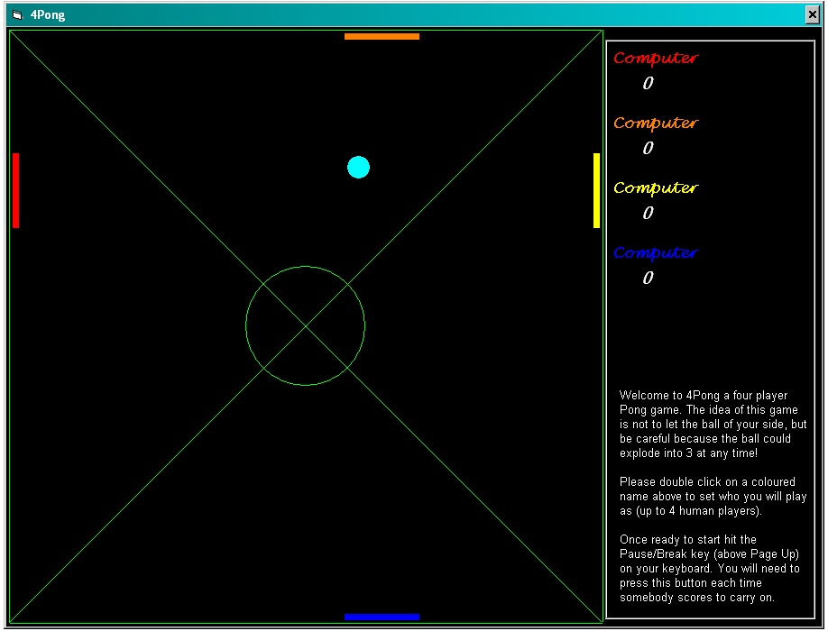



## A Four Player Pong Game \- 4Pong

### Description

I came up with the idea of having a four player pong game in college when player on a friends pong game. So I sat down and coded it. 

This game allows for four human players to four computer players (with varining levels of difficulties). It's extremely fun to play, if I do say so myself!

However watch out because every so oftern the ball might explode into three different ones at different speeds and directions!

Please comment on what features you like and what you think could make the game better, thank you.
 
### More Info
 

             |
---                |---
**Submitted On**   |2004-11-12 09:49:04
**By**             |[\-=Phenix=\-](https://github.com/Planet-Source-Code/PSCIndex/blob/master/ByAuthor/phenix.md)
**Level**          |Intermediate
**User Rating**    |4.6 (32 globes from 7 users)
**Compatibility**  |VB 6\.0
**Category**       |[Games](https://github.com/Planet-Source-Code/PSCIndex/blob/master/ByCategory/games__1-38.md)
**World**          |[Visual Basic](https://github.com/Planet-Source-Code/PSCIndex/blob/master/ByWorld/visual-basic.md)
**Archive File**   |[A\_Four\_Pla18173811122004\.zip](https://github.com/Planet-Source-Code/phenix-a-four-player-pong-game-4pong__1-57208/archive/master.zip)

